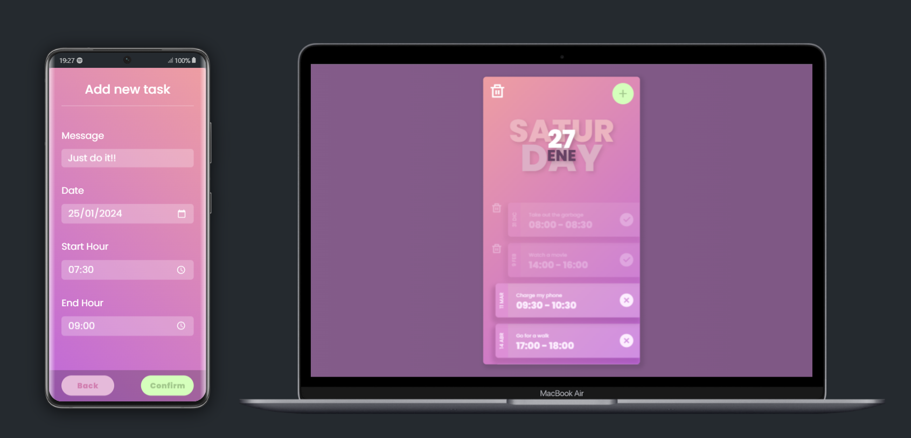

# Responsive Todo List Application

## Description

Welcome to the Responsive Todo List Application, a beautifully designed project aimed at managing your tasks seamlessly.

This application features a minimalist design with glasmorphism, showcasing the current date in a beautiful layout, a scrollable list of tasks, a button to delete all tasks, and persistence of tasks in local storage, ensuring that your data is retained even after page refresh.

Each task has two states: completed and pending, with the ability to toggle between them.

The application also includes a form for adding new tasks, where each task can include a date, start time, end time, and a message.

The form is validated to ensure that the end time is not earlier than the start time and that the date is not in the past.

## Technologies Used

- **HTML:** Provides the structure and layout of the todo list application.
- **CSS:** Styles the application, implementing glasmorphism and ensuring a visually appealing interface.
- **JavaScript:** Adds interactivity and dynamic behavior to the todo list, including form validation and task management.

## Features

- Beautifully designed minimalist interface with glasmorphism.
- Ability to view and manage tasks with ease.
- Persistent storage of tasks in local storage.
- Task states: completed and pending, with toggling functionality.
- Form validation to ensure data integrity and accuracy.

## Live Demo

Experience the live demo: [Live Demo](https://guidopellegrini.github.io/responsive-todo-list/)

## Preview

